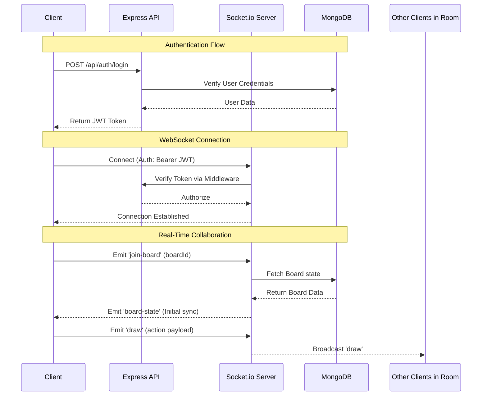

# CollabBoard - Backend

Node.js + Express backend with real-time Socket.io server & MongoDB persistence.



## 🛠 Tech Stack
Node.js • Express • Socket.io • MongoDB • JWT • bcryptjs

## 📡 API Endpoints & WebSocket Events

### Authentication
| Method | Endpoint | Description |
|--------|----------|-------------|
| POST | /api/auth/login | Authenticate user & return JWT |
| POST | /api/auth/register | Register new user |

### Boards
| Method | Endpoint | Auth Required | Description |
|--------|----------|---------------|-------------|
| GET | /api/boards | Yes | Fetch all boards |
| POST | /api/boards | Yes | Create new board |
| DELETE | /api/boards/:boardId | Yes | Delete board (owner only) |

### WebSocket Events
| Event | Type | Purpose |
|-------|------|---------|
| join-room | Listen | Initialize room, auth check, state recovery |
| draw-action | Listen/Broadcast | Sync real-time drawing actions |
| cursor-move | Listen/Broadcast | Real-time cursor tracking |
| toggle-permission | Listen | Admin toggle for drawing rights |
| user_list | Emit | Update online users list |

## 🚀 Quick Start

### Prerequisites
- Node.js v18+
- MongoDB (Local or Atlas)

1. **Clone repository:**
   ```bash
   git clone https://github.com/soham-kolhe/CollabBoard-backend
   cd CollabBoard-backend
   ```

2. **Install dependencies:**
   ```bash
   npm install
   ```

3. **Configure environment (.env):**
   ```env
   PORT=5000
   MONGODB_URI=your_mongodb_connection_string
   JWT_SECRET=your_secret_key
   FRONTEND_URL=http://localhost:5173
   ```

4. **Run server:**
   ```bash
   npm run dev
   ```

## 🔒 Security
Passwords encrypted with bcryptjs • JWT authentication for REST & WebSocket • Rate limiting on API endpoints • CORS validation

## 🔗 Quick Links

- 🖥️ [Frontend](https://github.com/soham-kolhe/CollabBoard-frontend)
- 📦 [Main Project](https://github.com/soham-kolhe/CollabBoard)

---

Created by [Soham Kolhe](https://github.com/soham-kolhe)

