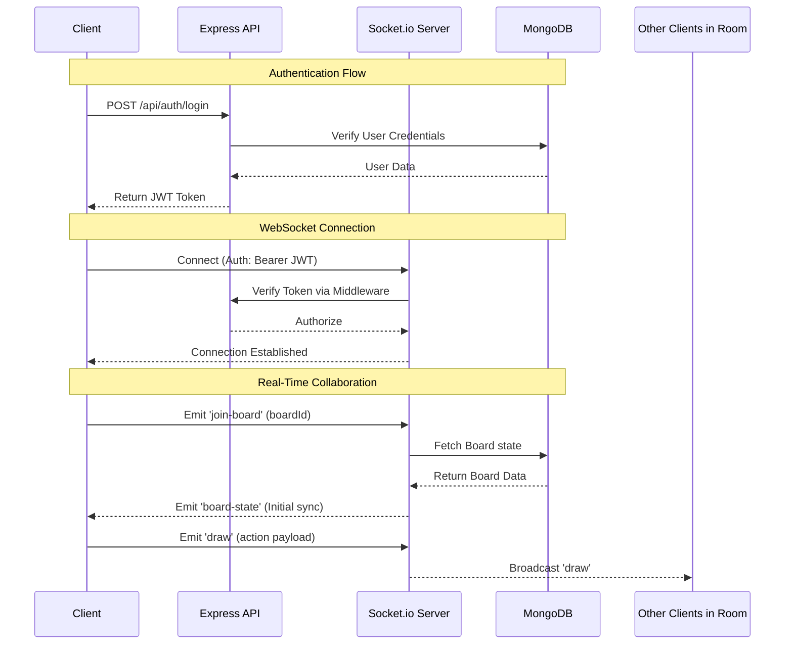

# Collaborative Board - Backend

This repository contains the backend service for the Collaborative Board application. It provides REST APIs for authentication and board management, and a robust WebSocket server for real-time canvas synchronization.

## 🚀 Tech Stack

- **Node.js & Express**: API routing and middleware.
- **Socket.io**: Real-time, bi-directional communication for collaborative drawing.
- **MongoDB & Mongoose**: Database and ODM for storing users and persistent board data.
- **JWT & bcryptjs**: Secure authentication and password hashing.
- **Express Rate Limit**: API protection against brute-force attacks.

## 📐 Architecture & Event Flow

The diagram below illustrates the sequence of authentication and real-time collaboration:



## 📁 Key Directories
- `config/`: Database connection and other configuration setups.
- `models/`: Mongoose schemas for User, Board, and ActiveUser.
- `routes/`: Express API endpoints (/api/auth, /api/boards).
- `sockets/`: Socket.io event handlers and real-time logic.
- `middleware/`: Auth verification and rate limiters.

## 🛠 API Endpoints

### Authentication (`/api/auth`)
| Method | Endpoint | Description |
| :--- | :--- | :--- |
| POST | `/login` | Authenticate user & return JWT |
| POST | `/register` | Register a new user |

### Boards (`/api/boards`)
| Method | Endpoint | Description | Auth Required |
| :--- | :--- | :--- | :--- |
| GET | `/` | Fetch all boards (owned & joined) | Yes |
| POST | `/` | Create a new collaborative board | Yes |
| DELETE | `/:boardId` | Delete a board (Owner only) | Yes |

## 🔌 WebSocket Events (Socket.io)
| Event | Type | Payload | Description |
| :--- | :--- | :--- | :--- |
| `join-room` | Listen | `{ userName, roomId }` | Initialize room join, auth check, and state recovery |
| `draw-action` | Listen/Broadcast | `{ roomId, action }` | Sync real-time drawing actions |
| `cursor-move` | Listen/Broadcast | `{ roomId, x, y }` | Real-time cursor tracking for all participants | 

| `toggle-permission` | Listen | `{ targetSocketId, roomId }` | Admin-only toggle for user drawing rights |
| `user_list` | Emit | `Array<User>` | Update list of online users in the room |

## 📜 Available Scripts

- `npm start`: Runs the server in production mode using node server.js.
- `npm run dev`: (Recommended for Dev) Runs the server using nodemon for auto-restarts.

## 🔒 Security
- Passwords are encrypted before saving using `bcryptjs`.
- Sensitive routes and socket connections are protected via JSON Web Tokens (JWT).
- API requests are rate-limited to prevent spam.

> ### 💡 IMPORTANT / NOTES 
> This repository contains the **Backend API only**.<br>
> **CORS**: Ensure `FRONTEND_URL` matches your React app's URL exactly.<br>
> **Database Cleanup**: On server start, the system automatically clears the `ActiveUser` collection to prevent zombie connection errors.<br>
> The interactive **React + TypeScript frontend** can be found here:<br>
> 👉 [Frontend](https://github.com/soham-kolhe/collaborative-board-frontend)

## ⚙️ Setup & Installation

### Prerequisites
- Node.js (v18 or higher)
- MongoDB (Local or Atlas instance)
<hr>

1. **Clone the repository:**
   ```bash
   git clone <your-repo-url>
   cd collaborative-board-backend
   ```

2. **Install dependencies:**
   ```bash
   npm install
   ```

3. **Environment Variables:**
   Create a `.env` file in the root directory based on `.env.example`:
   ```env
   PORT=5000
   MONGODB_URI=your_mongodb_connection_string
   JWT_SECRET=your_super_secret_key
   FRONTEND_URL=http://localhost:5173
   ```

4. **Start the server:**
   ```bash
   npm start
   ```
## 💻 Created By
Soham Kolhe